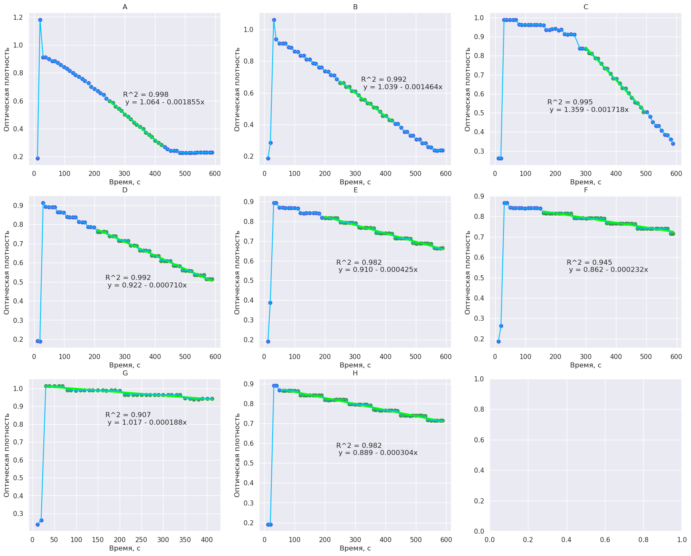

# Делаем графики из фоток монитора спектрофотометра Ultrospec 2100 pro
Фоткайте без бликов (отключите вспышку) в хорошем разрешении.
Полезен при проблемах с передачей данных на компьютер по COM порту.

 

## План действий
1. Установить в окружение пакеты из `requirements.txt`:
   
   `pip install -r requirements.txt`
2. Установить в окружение jupyter, к примеру `pip install notebook`
3. Использовать `mark_edges.ipynb` чтобы получить координаты угловых точек будующих графиков
   - Приближать участки фото колесиком
   - Используйте ЛКМ для получения координат (см. ниже)
   - Кликать углы в следующей последовательности
       - **A.** Левый верхний
       - **B.** Правый верхний
       - **C.** Левый нижний
       - **D.** Правый нижний
   1. Скопировать координаты в формате x y
4. Вставить координаты в `jpeg2csv.ipynb` в формате [x, y] для каждой точки [**Perspective Transform**]
5. Указать путь к фото [**Perspective Transform**]
6. Запустить **Perspective Transform**
7. Сохранить промежуточный файл
8. Постараться подобрать порог (в районе **0.65-0.72**) так, чтобы все точки кроме крайних были распознаны. Если не получается и пропуск точек критичен:
   - Попытаться подобрать порог так, чтобы лишних точек не было
   - Скопировать координаты недостающих точек с помощью `mark_edges.ipynb` в промежуточном файле: `temp.png`
   - Добавить их в переменную `centers` в формате (x, y)
9.  Задать минимумы и максимумы осей для построения графика [**Scale**]
10. Сохранить csv
11. Проверить получившийся график
12. Повторить пункты **3-11** для оставшихся фото
13. Переименовать полученные csv файлы для указания порядка на графике: `1.csv, 2.csv, ...`
14. Запустить `csv2graph.ipynb`
15. Поподбирать области линейности и положение аннотации для каждого графика [**p variable**]

## Правильно выбираем углы

## QR код для наклейки на СФ Ultrospec 2100 pro

QR код ведет к этому репозиторию

<a id="raw-url" href="doc/qrcode_print.odt">Ссылка на word файл для печати</a>

## Фото шаблон
Для нахождения точек применяется поиск шаблона, если что-то совсем не получается, то можно поменять шаблон

## TODO
- Добавить распознавание углов
- Добавить определение области линейности